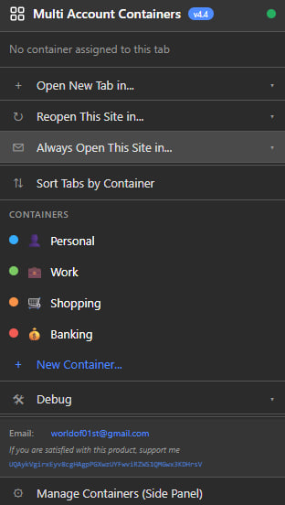
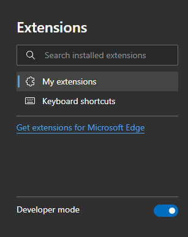
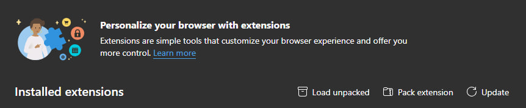
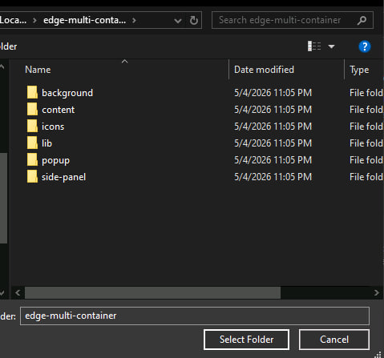

# Chromium Multi Container

A browser extension for managing multiple isolated containers/tabs in Chromium‑based browsers (Chrome, Edge, Brave, etc.).

*Main extension view*

## Installation (Developer Mode)

Since the extension is not yet published in the web store, you need to load it manually.

1. **Open the Extensions page**  
   Go to `chrome://extensions` (or `edge://extensions` in Microsoft Edge).

2. **Enable Developer Mode**  
   Toggle the **Developer mode** switch at the top‑right corner.  
   

3. **Click "Load unpacked"**  
   After enabling Developer mode, a new button appears. Click **Load unpacked**.  
   

4. **Select the extension folder**  
   In the file dialog, navigate to the folder that contains your extension files (make sure `manifest.json` is inside). Select the folder and click **Select Folder** (or **Open**).  
   

The extension icon should now appear in your browser toolbar. You're ready to use it.

## Features

- Isolated container management for different browsing contexts
- Quick tab switching and grouping
- Lightweight, built on Chromium’s multi‑process architecture

## Usage

(Describe how to use your extension – e.g., click the icon, create new containers, switch between them, etc.)

## Project Structure
